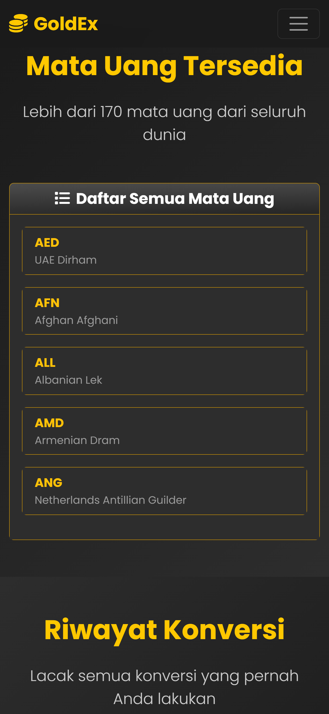
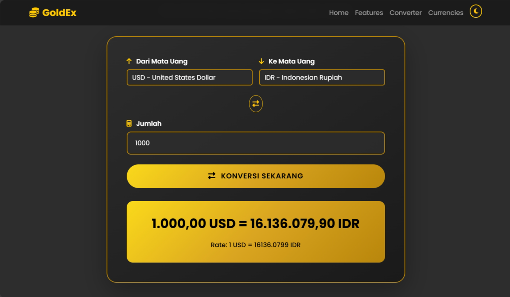
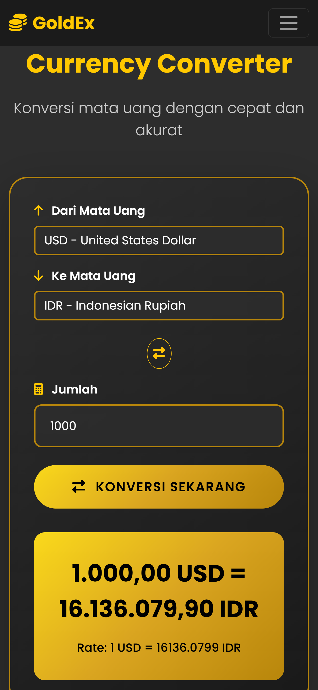
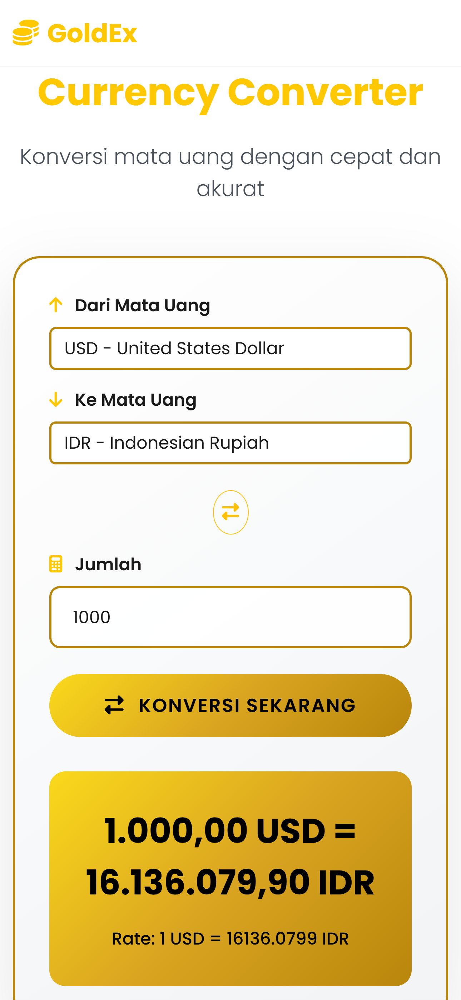

# 💱 Go Currency Converter

Go Currency Converter is a **Golang-based** web application that allows users to convert currency values in real-time using the latest exchange rates. This project was built as a learning exercise and a demonstration of implementing Go in web application development.

---

## ✨ Features
- Convert values between multiple currencies.
- Real-time exchange rate retrieval from an external API.
- Simple and responsive web interface.
- Input validation to ensure correct data entry.
- Deployed on **Vercel** for public access.

---

## 🛠️ Tech Stack
- **Backend:** Go (net/http)
- **Frontend:** HTML, CSS, JavaScript
- **Exchange Rate API:** [ExchangeRate API](https://exchangerate.host/) or other
- **Deployment:** Vercel

---

## 📸 Screenshots
### 🏠 Main Page

  
  
  
  

---
### 🔍 All Currencies

  
  

---
### 💭 Conversion Result 

  
  
  
  

---

## 👩‍💻 About the Developer

By **Dewi Atika Muthi**  
📍 _Informatics Student, Telkom University_  
📧 **Email:** detikaa10@fmail.com  
🌐 **GitHub:** [@tikature](https://github.com/tikature)  

💬 *"Design with simplicity, build with purpose."*

